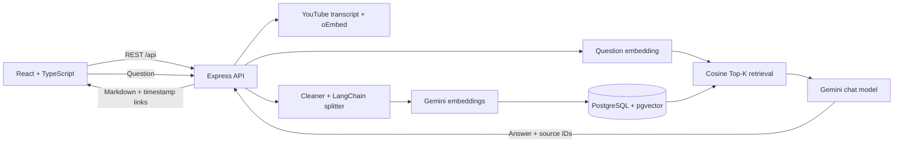

# StudyTube AI

StudyTube AI is a production-oriented full-stack application for asking grounded questions about captioned YouTube videos. It extracts—not downloads—the transcript, preserves timestamps, creates Google Gemini embeddings, stores them in PostgreSQL with pgvector, retrieves only relevant passages, and returns a Gemini answer with clickable source moments.

## Features

- YouTube watch, short, live, embed, and `youtu.be` URL validation
- Caption extraction without downloading video media
- Transcript cleanup and timestamp-preserving, overlapping chunking
- Batched Gemini embeddings with configurable model and dimensions
- PostgreSQL + pgvector persistence with an HNSW cosine index
- Idempotent video indexing: ready videos reuse their stored chunks and embeddings
- Top-K semantic retrieval; the full transcript is never sent to the chat model
- Provider interface that keeps the AI layer open to Anthropic or another LLM
- Multi-turn, video-scoped chat sessions with rename, delete, and resume flows
- Markdown responses, code blocks, and real clickable timestamp sources
- Responsive SaaS UI with light/dark mode, loading, empty, error, and toast states
- Helmet, constrained CORS, input limits, Zod validation, and AI endpoint rate limits
- Structured errors that do not leak stack traces or API keys

## Architecture



The backend follows a layered structure: routes validate and dispatch, controllers shape HTTP responses, services own business and AI logic, models map database records, and middleware provides request protection and safe error handling.

## How RAG works

1. The API validates the URL and extracts the canonical 11-character YouTube ID.
2. It checks for an already-ready `videos.youtube_id`; a hit returns without another embedding call.
3. It fetches captions and oEmbed metadata, normalizes either millisecond or second transcript timing, removes empty/noise segments, and enforces the transcript size limit.
4. LangChain's recursive splitter handles unusually long caption segments. The chunk assembler adds configurable overlap while carrying the first and last real transcript timestamps.
5. The embedding service batches chunk text. A transaction replaces any failed/stale partial index and marks the video ready only after every pgvector row is stored.
6. For each question, the API creates one question embedding and runs cosine similarity against chunks for that chat's video only.
7. The top `TOP_K` chunks—rather than the complete transcript—are formatted as bounded context. The system prompt instructs the LLM to admit when the video does not support an answer.
8. The answer and exact retrieved chunk metadata are stored. The UI renders source links as `youtube.com/watch?v=…&t=…s` without inventing timestamps.

## Tech stack

| Layer | Technology |
| --- | --- |
| Web | React 19, TypeScript, Vite, Tailwind CSS, React Markdown |
| API | Node.js 20+, Express 5, TypeScript, Zod |
| AI | Google Gemini embeddings and text generation behind an `AIProvider` interface |
| RAG | LangChain text splitter, cosine Top-K retrieval |
| Data | PostgreSQL 16, pgvector, HNSW index |
| Quality | Vitest, Supertest, TypeScript project builds |

## Project structure

```text
studytube-ai/
├── frontend/
│   ├── src/
│   │   ├── components/       # Landing, sidebar, chat, messages, progress, toast
│   │   ├── lib/api.ts        # Typed REST client
│   │   ├── App.tsx           # Application orchestration
│   │   └── types.ts
│   ├── tailwind.config.js
│   └── vite.config.ts
├── backend/
│   ├── src/
│   │   ├── config/           # Validated environment and PostgreSQL pool
│   │   ├── controllers/
│   │   ├── database/         # Migration runner and pgvector schema
│   │   ├── middleware/       # Validation, rate limiting, safe errors
│   │   ├── models/
│   │   ├── routes/
│   │   ├── services/         # YouTube, chunks, embeddings, vector search, RAG, chat
│   │   ├── types/
│   │   └── utils/
│   └── vitest.config.ts
├── .env.example
├── docker-compose.yml
└── package.json              # npm workspaces
```

## Installation

Requirements:

- Node.js 20 or newer
- npm 10 or newer
- Docker Desktop, or PostgreSQL with the pgvector extension
- A Google Gemini API key from [Google AI Studio](https://aistudio.google.com/apikey)

```bash
git clone <your-repository-url>
cd studytube-ai
npm install
```

Copy the root environment template:

```powershell
Copy-Item -LiteralPath .env.example -Destination .env
```

On macOS or Linux, use `cp .env.example .env`. Add the real `GEMINI_API_KEY` only to `.env`; it is gitignored and is never read by browser code. Vite reads the same root file, but only variables prefixed with `VITE_` are exposed to the client.

New eligible Gemini API projects begin on Google's free tier. Free-tier quotas are limited, and Google may use free-tier prompts and responses to improve its products; do not process private or sensitive transcripts on that tier.

## Environment variables

| Variable | Default/example | Purpose |
| --- | --- | --- |
| `GEMINI_API_KEY` | required | Server-only API credential from Google AI Studio |
| `DATABASE_URL` | local Docker URL | PostgreSQL connection string |
| `PORT` | `4000` | Express port |
| `CLIENT_URL` | `http://localhost:5173` | Exact allowed browser origin |
| `VITE_API_URL` | `http://localhost:4000/api` | Public frontend API base |
| `GEMINI_CHAT_MODEL` | `gemini-3.5-flash` | Free-tier answer-generation model |
| `GEMINI_EMBEDDING_MODEL` | `gemini-embedding-2` | Free-tier text embedding model |
| `GEMINI_EMBEDDING_DIMENSIONS` | `1536` | Must remain `1536` to match the migration vector width |
| `CHUNK_SIZE` | `1200` | Approximate chunk size in characters |
| `CHUNK_OVERLAP` | `200` | Character target retained between chunks |
| `TOP_K` | `5` | Transcript chunks retrieved per question |
| `EMBEDDING_BATCH_SIZE` | `64` | Texts per embeddings API call |
| `MAX_TRANSCRIPT_CHARS` | `2000000` | Transcript safety ceiling |
| `AI_RATE_LIMIT_WINDOW_MS` | `60000` | Expensive-request rate window |
| `AI_RATE_LIMIT_MAX` | `20` | Expensive requests per IP/window |

The application intentionally validates that `GEMINI_EMBEDDING_DIMENSIONS` is `1536`, matching `vector(1536)` in the migration.

## Database setup

Start the included pgvector image, apply the schema, then run the application:

```bash
docker compose up -d postgres
npm run db:migrate
npm run dev
```

Open [http://localhost:5173](http://localhost:5173). The API health endpoint is [http://localhost:4000/api/health](http://localhost:4000/api/health).

The migration creates `users`, `videos`, `transcript_chunks`, `chat_sessions`, and `messages`; enables `vector` and `pgcrypto`; enforces unique YouTube IDs; adds relationship indexes; and creates an HNSW `vector_cosine_ops` index.

Each indexed video records its embedding provider, model, and dimensions. Videos indexed by an older OpenAI version, or by a different Gemini embedding model, are automatically reprocessed instead of mixing incompatible vector spaces.

## Windows quick start

Open Docker Desktop and wait for its engine to report that it is running. Then open PowerShell in the project folder and run:

```powershell
Set-Location -LiteralPath 'C:\Users\Priyanshu Kumar\Documents\Codex\2026-08-19\files-pasted-by-the-user-build'
Start-Process 'https://aistudio.google.com/apikey'
notepad .env
```

Paste the Google AI Studio key after `GEMINI_API_KEY=` in `.env`, save it, and continue:

```powershell
npm install
docker compose up -d postgres
docker compose ps
npm run db:migrate
npm run dev
```

Keep that PowerShell window open. Visit [http://localhost:5173](http://localhost:5173), submit a public YouTube video with captions, and ask a question about its content. Ollama is not used or required by the Gemini version.

## API documentation

All JSON responses use `{ "success": true, "data": ... }`. Errors use `{ "success": false, "error": { "message": "...", "code": "..." } }`.

| Method | Route | Body | Result |
| --- | --- | --- | --- |
| `GET` | `/api/health` | — | Service status |
| `POST` | `/api/videos/process` | `{ "url": "..." }` | New or reused ready video |
| `GET` | `/api/videos` | — | Indexed videos |
| `GET` | `/api/videos/:id` | — | One video |
| `POST` | `/api/chats` | `{ "videoId": "uuid", "title"?: "..." }` | New video-scoped chat |
| `GET` | `/api/chats` | — | Chat history summaries |
| `GET` | `/api/chats/:id` | — | Session, video, and messages |
| `PATCH` | `/api/chats/:id` | `{ "title": "..." }` | Renamed chat |
| `DELETE` | `/api/chats/:id` | — | `204 No Content` |
| `POST` | `/api/chats/message/send` | `{ "chatId": "uuid", "question": "..." }` | Stored user + assistant messages |

Example:

```bash
curl -X POST http://localhost:4000/api/videos/process \
  -H "Content-Type: application/json" \
  -d '{"url":"https://www.youtube.com/watch?v=VIDEO_ID"}'
```

## Screenshots and UI tour

The runtime interface is available immediately after `npm run dev`; capture this section from your deployed branded environment instead of committing a misleading mock screenshot. The included UI provides:

- **Landing:** a focused URL composer, three RAG trust signals, and honest multi-stage processing feedback.
- **Workspace:** current video thumbnail/title/status in the header, mobile drawer navigation, and persistent conversation history.
- **Chat:** suggested starter questions, Enter/Shift+Enter keyboard behavior, optimistic user messages, Markdown/code rendering, and compact timestamp source chips.
- **Management:** add another video, resume a conversation, or rename/delete a chat from the sidebar.
- **Themes:** light and dark palettes persist locally without sending preferences to the server.

## Testing and verification

```bash
npm test
npm run typecheck
npm run build
```

The test suite covers valid/invalid YouTube URL forms, transcript cleanup, millisecond timing normalization, overlapping timestamped chunks, Gemini retrieval-input formatting, Gemini conversation construction, RAG context construction, request validation, health responses, and structured 404 handling. Database/Gemini integration tests require real services and are intentionally not faked in the unit suite.

## Production deployment

1. Provision PostgreSQL with pgvector and run `npm run db:migrate` as a release step.
2. Build both workspaces with `npm run build`.
3. Run the API with `npm start -w backend` and serve `frontend/dist` through a static host/CDN.
4. Set `CLIENT_URL` to the deployed frontend origin and set `VITE_API_URL` at frontend build time.
5. Store secrets in the platform secret manager. Never ship the root `.env`.
6. For horizontal processing at high scale, add a job queue and replace the short processing-state lease with distributed workers.

The API handles termination signals and drains its PostgreSQL pool. Production deployments should also add TLS at the edge, managed database backups, centralized logs, request tracing, and an allowlisted outbound policy for YouTube and the Gemini API.

## Current constraints

- Videos need accessible YouTube captions; disabled, missing, age-restricted, geo-blocked, or access-challenged transcripts return a useful error.
- YouTube does not offer a stable public transcript API, so extraction can require maintenance if YouTube changes its page/caption format.
- Authentication is deliberately not enabled. The nullable `users` relationship and service boundaries are ready for it, but deploy this version as a single-tenant workspace or add auth before exposing private/shared infrastructure.
- Chat responses are non-streaming to keep the core persistence path simple.

## Future improvements

- Authentication, teams, and per-user authorization
- Multi-video and playlist-scoped retrieval
- Summaries, structured notes, quizzes, and interview questions
- PDF ingestion alongside video transcripts
- Streaming answers and cancellable processing jobs
- Hybrid keyword/vector retrieval, reranking, and retrieval evaluation
- Voice questions, analytics, and usage/cost dashboards

## License

Choose and add the license appropriate for your deployment.
